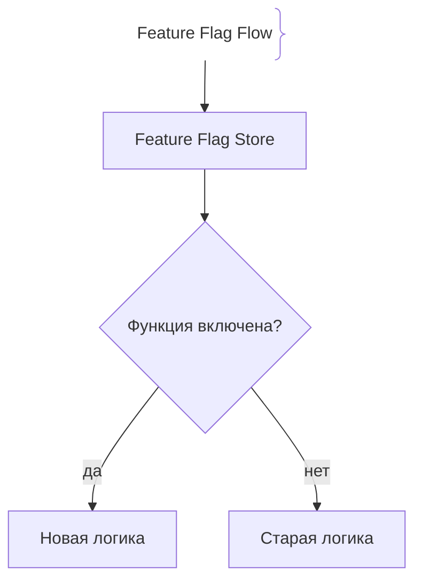
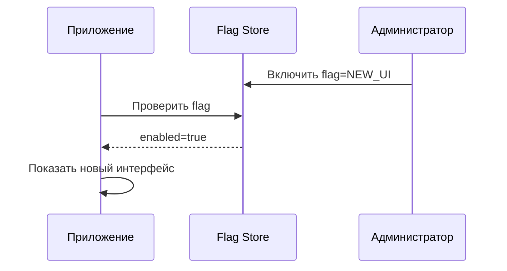

# Feature Flags (Флаги функций)

## Определение

Feature Flags — это механизм управления доступностью функций приложения без необходимости пересобирать и деплоить новый релиз.

## Зачем нужны Feature Flags

Выпуск новой функции в продакшн — это риск.
- **Быстрый откат:** Если функция сломалась, её можно отключить одной настройкой без нового деплоя.
- **A/B-тестирование:** Новая функциональность доступна только части пользователей.

## Как работают Feature Flags архитектура





## Примеры кода

> Ключевые сценарии: настройка Feature Flag в коде приложения.

### TypeScript Feature Flag (условный рендеринг)

```typescript
const isNewCheckoutEnabled = getFeatureFlag('new_checkout')

if (isNewCheckoutEnabled) {
  return <NewCheckout />
}
return <LegacyCheckout />
```

## Пример использования: интеграция

Проверка флага в коде вместо передеплоя:

```ts
import { useFlag } from '@launchdarkly/node-server-sdk'

async function handler(req, res) {
  const flag = await client.variation('newCheckout', { key: req.user.id }, false)

  if (flag) {
    return renderNewCheckout(req, res)      // новая логика
  }
  return renderLegacyCheckout(req, res)     // старая логика
}
```

Флаг управляется из панели без сборки и деплоя: отключение одной настройкой возвращает старую ветку мгновенно.

## Паттерны использования

- **Использовать для постепенного выката** — флаг + процент аудитории вместо разом на всех.
- **Dedicated rollout с мониторингом** — включение под наблюдением метрик.
- **Перманентные vs временные флаги** — кодовые дедлайны выпиливают отработанные флаги.
- **Флаг по умолчанию выключен** — безопасный дефолт и покрытие тестами обеих веток.

## Антипаттерны и ловушки

- **Флаг на каждую мелочь** — сотни флагов запутывают логику и тесты.
- **Флаг «всегда включён» после выката** — мёртвый код с условием, который никто не удаляет.
- **Хранить секреты в панели флагов** — утечка через сторону поставщика.
- **Зависимость всего приложения от сервиса флагов** — недоступность SDK ломает деплой; кэш с дефолтом обязателен.

## Когда использовать / когда НЕ использовать

- **Использовать:** выкаты, где важен мгновенный откат и A/B; тёмные запуски новых функций.
- **НЕ использовать:** для частых конфигурационных значений — для этого конфиг; для логики, которая не требует отключения в рантайме — простой деплой быстрее.

## Связанные темы

- **canary-releases** — дозирование трафика, сочетаемое с флагами.
- **blue-green-deployment** — стратегия релиза, где откат — переключение сред.
- **rollbacks** — механический возврат версии вместо отключения флага.

## Вопросы

### Q1
**Что такое Feature Flag?**
- [ ] Шифрование данных
- [x] Переключатель, управляющий доступностью функции без нового деплоя
- [ ] База данных
- [ ] Система мониторинга

Пояснение: Flag позволяет включать или отключать функции в runtime.

### Q2
**Главное преимущество Feature Flags?**
- [ ] Ускорение компиляции
- [x] Возможность быстро отключить проблемную функцию без релиза
- [ ] Уменьшение размера приложения
- [ ] Шифрование трафика

Пояснение: Отключение flag не требует пересборки и повторного деплоя.

### Q3
**Что такое A/B-тестирование с Feature Flags?**
- [ ] Сравнение двух версий API
- [x] Демонстрация функции разным группам пользователей для измерения метрик
- [ ] Тестирование на двух браузерах
- [ ] Сравнение серверов

Пояснение: Разные пользователи видят разные версии функциональности.

### Q4
**Что происходит при включении Feature Flag?**
- [ ] Приложение перезагружается
- [x] Новая логика начинает применяться у пользователей
- [ ] Удаляются старые данные
- [ ] Отключается база данных

Пояснение: Flag переключает поведение приложения на runtime-уровне.

### Q5
**Какая опасность у Feature Flags?**
- [ ] Увеличение скорости работы
- [x] Накопление неиспользуемых флагов и усложнение кода
- [ ] Отключение интернета
- [ ] Уменьшение безопасности

Пояснение: Старые флаги нужно удалять после завершения их использования.

## Источники

- Feature Flags Docs: https://docs.launchdarkly.com/
- Google SRE Book