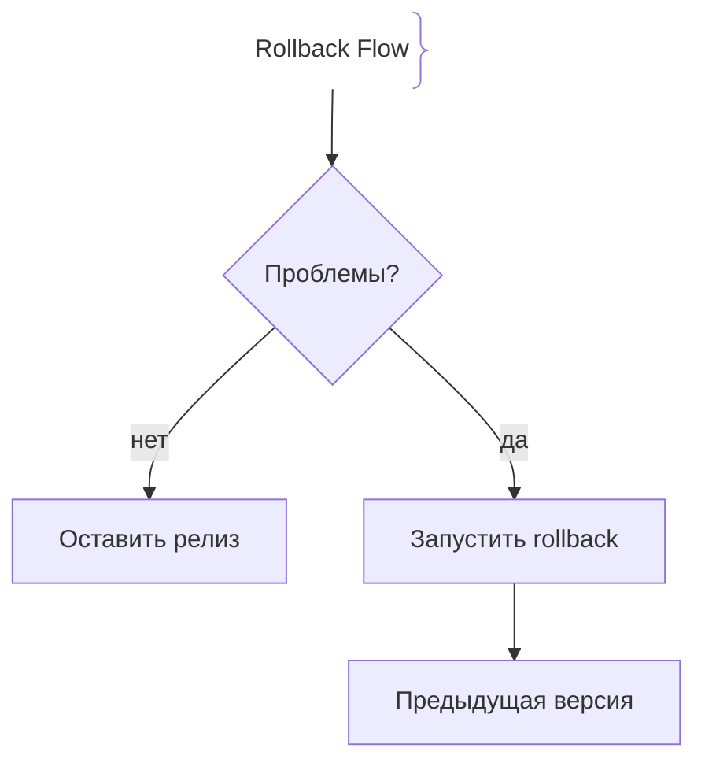
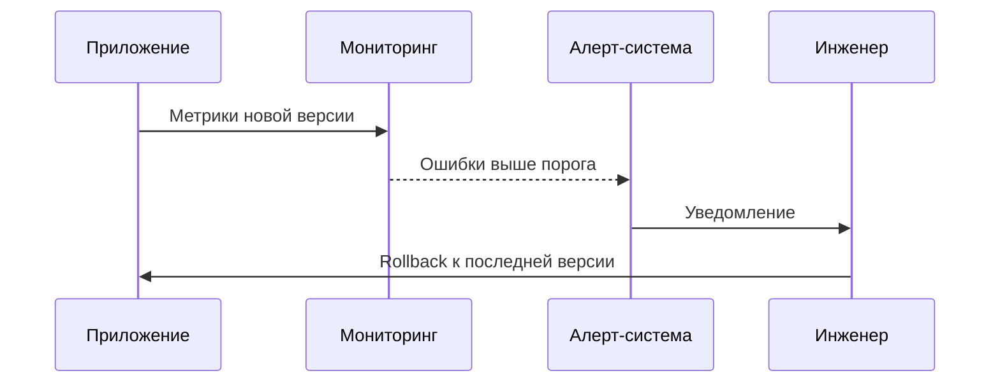

# Откаты (Rollbacks)

Rollback — это процесс возврата приложения к предыдущей стабильной версии при обнаружении проблем в новой версии.

## Зачем нужны Rollbacks

Любой релиз может содержать ошибки.
- **Быстрое восстановление:** Возврат к рабочей версии снижает ущерб.
- **Защита пользователей:** Пользователи снова получают стабильную версию.

## Как работают Rollbacks архитектура





## Примеры кода

> Ключевые сценарии: откат релиза в Kubernetes.

### Kubernetes Rollback Command

```bash
kubectl rollout undo deployment/my-app
```

## Вопросы

### Q1
**Что такое Rollback?**
- [ ] Удаление приложения
- [x] Возврат к предыдущей стабильной версии
- [ ] Увеличение трафика
- [ ] Шифрование данных

Пояснение: Rollback возвращает систему в известное рабочее состояние.

### Q2
**Когда выполняется Rollback?**
- [ ] При успешном релизе
- [x] При обнаружении критических ошибок или деградации
- [ ] При обычном обновлении
- [ ] При плановом обслуживании

Пояснение: Rollback нужен при проблемах в новой версии.

### Q3
**Что делает команда `kubectl rollout undo`?**
- [ ] Удаляет приложение
- [x] Возвращает Deployment к предыдущей ревизии
- [ ] Увеличивает реплики
- [ ] Отключает мониторинг

Пояснение: Kubernetes хранит историю ревизий Deployment.

### Q4
**Что важно перед Rollback?**
- [ ] Удалить логи
- [x] Проверить причины сбоя и данные
- [ ] Отключить SSL
- [ ] Удалить базу данных

Пояснение: Нужно понять, что сломалось, чтобы не повторить ошибку.

### Q5
**Можно ли откатить базу данных?**
- [ ] Нет, только приложение
- [x] Да, через backup/snapshot или миграции
- [ ] Нельзя вообще
- [ ] Только вручную

Пояснение: Данные БД требуют отдельной стратегии восстановления.

## Источники

- Kubernetes Rollback Docs: https://kubernetes.io/docs/
- Google SRE Book