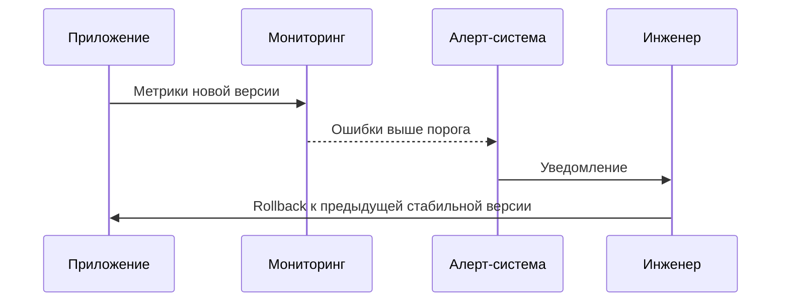

# Откаты (Rollbacks)

## Определение

Rollback — это процесс возврата приложения к предыдущей стабильной версии при обнаружении проблем в новой версии.

## Зачем нужны Rollbacks

Любой релиз может содержать ошибки.
- **Быстрое восстановление:** Возврат к рабочей версии снижает ущерб.
- **Защита пользователей:** Пользователи снова получают стабильную версию.

## Как работают Rollbacks




## Примеры кода

> Ключевые сценарии: откат релиза в Kubernetes.

### Kubernetes Rollback Command

```bash
kubectl rollout undo deployment/my-app
```

## Пример использования: интеграция

Возврат к предыдущей версии Deployment одной командой:

```bash
kubectl rollout undo deployment/api

kubectl rollout status deployment/api
```

Helm и Argo Rollouts откатывают аналогично: `helm rollback api 3` возвращает прошлый release, а при анализе канарейки откат происходит автоматически.

## Паттерны использования

- **Решение принимается по метрикам, а не «на глаз»** — порог из SLO запускает откат.
- **Скорость отката важнее долгих анализов** — 10 минут на rollback дешевле, чем час обсуждений.
- **Откат схемы данные** — миграции обратимы или версионируются вместе с релизом.
- **Автоматический откат в маршрутизации** — флаги и canary-аналитику стопят выкат сами.

## Антипаттерны и ловушки

- **Откат по «ощущениям», без алертов** — релиз живёт на проде дольше, чем надо.
- **Откат кода без обратной миграции схемы** — новый миграционный код без согласования ломает данные.
- **«Чинить поверх» вместо отката** — новый хотфикс поверх бага может углубить проблему.
- **Не проверить старую версию** — откат возвращает тот же самый известный баг.

## Когда использовать / когда НЕ использовать

- **Использовать:** любой прод-релиз с риском; откат обязателен в арсенале деплой-стратегии.
- **НЕ использовать:** когда повреждение данных делает откат опаснее фикса; там решает восстановление из бэкапов, а не rollback.

## Связанные темы

- **feature-flags** — мгновенное отключение функции без деплоя.
- **blue-green-deployment** — откат как переключение среды.
- **canary-releases** — дозированный выкат с автоматическим откатом.

## Вопросы

### Q1
**Что такое Rollback?**
- [ ] Удаление приложения
- [x] Возврат к предыдущей стабильной версии
- [ ] Увеличение трафика
- [ ] Шифрование данных

Пояснение: Rollback возвращает систему в известное рабочее состояние.

### Q2
**Когда выполняется Rollback?**
- [ ] При успешном релизе
- [x] При обнаружении критических ошибок или деградации
- [ ] При обычном обновлении
- [ ] При плановом обслуживании

Пояснение: Rollback нужен при проблемах в новой версии.

### Q3
**Что делает команда `kubectl rollout undo`?**
- [ ] Удаляет приложение
- [x] Возвращает Deployment к предыдущей ревизии
- [ ] Увеличивает реплики
- [ ] Отключает мониторинг

Пояснение: Kubernetes хранит историю ревизий Deployment.

### Q4
**Что важно перед Rollback?**
- [ ] Удалить логи
- [x] Проверить причины сбоя и данные
- [ ] Отключить SSL
- [ ] Удалить базу данных

Пояснение: Нужно понять, что сломалось, чтобы не повторить ошибку.

### Q5
**Можно ли откатить базу данных?**
- [ ] Нет, только приложение
- [x] Да, через backup/snapshot или миграции
- [ ] Нельзя вообще
- [ ] Только вручную

Пояснение: Данные БД требуют отдельной стратегии восстановления.

## Источники

- Kubernetes — Rolling Update / Rollback: https://kubernetes.io/docs/tutorials/kubernetes-basics/update/update-intro/
- Google SRE Book — управление релизами: https://sre.google/sre-book/