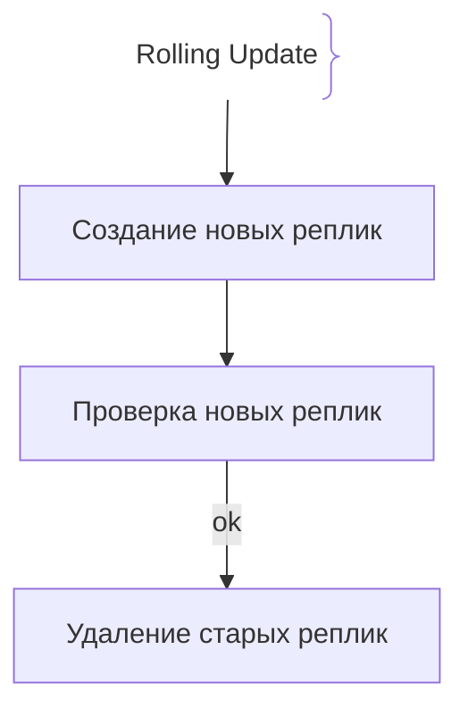
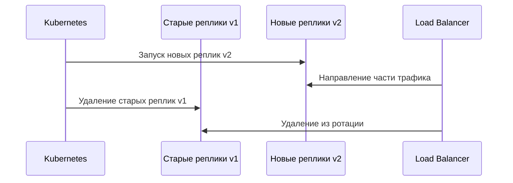

# Rolling Deployments (Постепенный деплой)

Rolling Deployment — стратегия постепенного обновления приложения, при которой новые экземпляры заменяют старые без простоя.

## Зачем нужны Rolling Deployments

Обновление приложения без прерывания работы пользователей.
- **Zero downtime:** Пользователи продолжают получать запросы во время обновления.
- **Контроль риска:** Не все экземпляры обновляются одновременно.

## Как работают Rolling Deployments архитектура





## Примеры кода

> Ключевые сценарии: настройка RollingUpdate в Kubernetes Deployment.

### Kubernetes Deployment (RollingUpdate)

```yaml
apiVersion: apps/v1
kind: Deployment
metadata:
  name: app
spec:
  strategy:
    type: RollingUpdate
    rollingUpdate:
      maxUnavailable: 0
      maxSurge: 1
```

## Вопросы

### Q1
**Что такое Rolling Deployment?**
- [x] Постепенная замена старых экземпляров новыми
- [ ] Полное отключение приложения
- [ ] Ручная установка
- [ ] Шифрование данных

Пояснение: Новые реплики запускаются постепенно, старые удаляются после проверки.

### Q2
**Что означает maxUnavailable: 0?**
- [ ] Можно отключить все экземпляры
- [x] Приложение должно оставаться доступным всегда
- [ ] Нельзя обновлять приложение
- [ ] Отключить мониторинг

Пояснение: Ноль недоступных экземпляров гарантирует zero downtime.

### Q3
**Что делает maxSurge?**
- [x] Увеличивает количество новых реплик сверх desired
- [ ] Уменьшает количество реплик
- [ ] Отключает приложение
- [ ] Шифрует трафик

Пояснение: Позволяет временно иметь больше экземпляров, чем desired.

### Q4
**Когда Kubernetes удаляет старые реплики?**
- [ ] Сразу после запуска новых
- [x] После того как новые прошли readiness-проверку
- [ ] При выключении сервера
- [ ] При удалении базы данных

Пояснение: Readiness-пробы гарантируют, что новая реплика готова принимать трафик.

### Q5
**Какая стратегия ближе к Rolling Deployment?**
- [ ] Одновременный деплой всех серверов
- [x] Постепенное обновление с контролем состояния
- [ ] Ручная переустановка
- [ ] Полное отключение приложения

Пояснение: Rolling — это контролируемое постепенное обновление.

## Источники

- Kubernetes Deployment Docs: https://kubernetes.io/docs/
- Kubernetes Rolling Update Guide