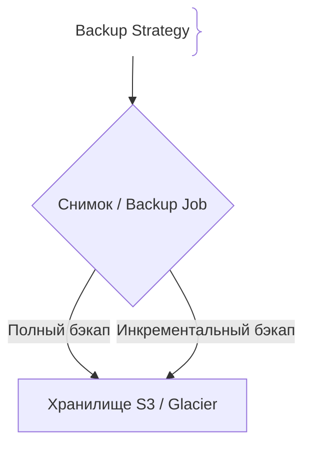
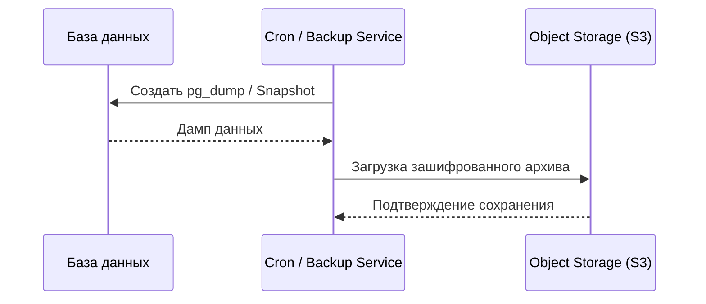

# Резервные копии (Backups)

## Определение

Backup — создание и хранение копий данных для защиты от их утраты, повреждения или удаления.

## Зачем нужны Backups

Данные — самый ценный актив компании.
- **Защита от ошибок:** Восстановление после случайного удаления (`DROP TABLE`).
- **Требования безопасности:** Соответствие стандартам (GDPR, HIPAA, PCI-DSS).

## Как работают Backups архитектура





## Примеры кода

> Ключевые сценарии: создание бэкапа базы данных PostgreSQL.

### Скрипт создания бэкапа (Bash)

```bash
#!/bin/bash
TIMESTAMP=$(date +"%Y%m%d_%H%M%S")
BACKUP_FILE="/backups/db_$TIMESTAMP.sql.gz"

pg_dump -U postgres mydb | gzip > "$BACKUP_FILE"
aws s3 cp "$BACKUP_FILE" s3://my-company-backups/
```

## Пример использования: интеграция

Плановый дамп базы с шифрованием и загрузкой в объектное хранилище:

```bash
#!/usr/bin/env bash
set -euo pipefail

BACKUP_TS=$(date -u +%Y%m%dT%H%M%S)
pg_dump -Fc "$DATABASE_URL" \
  | gpg --batch --yes --encrypt --recipient backups@example.com \
  | aws s3 cp - "s3://backups/prod/db-$BACKUP_TS.dump.gpg"

aws s3 ls "s3://backups/prod/" --recursive | aws s3 rm "s3://backups/prod/" --recursive \
  --exclude "*" \
  --include "*.gpg" --age > /dev/null
```

`pg_dump -Fc` даёт гибкий формат, шифрование закрывает данные в бакете, ротация очищает старые копии по расписанию.

## Паттерны использования

- **Правило 3-2-1** — три копии, на двух носителях, одна вне основной локации.
- **Full + incremental** — периодические полные, между ними — инкрементальные и WAL.
- **Автоматизация и проверка восстановления** — бэкап, который никогда не восстанавливали, — это не бэкап.
- **Шифрование и доступ по ролям** — копии в S3/GCS закрыты и доступны только компьютеру восстановления.

## Антипаттерны и ловушки

- **Бэкапы без проверки восстановления** — ошибочный дамп вскрывается только в момент аварии.
- **Хранить копию рядом с источником** — утрата носителя/региона уносит и оригинал, и копию.
- **Секреты в дампе в открытом виде** — архив в облаке светит паролями.
- **Бэкапы по «галочке» без RPO** — не определено, сколько данных терять допустимо.

## Когда использовать / когда НЕ использовать

- **Использовать:** все данные с бизнес-ценностью — БД, объектное хранилище, конфиг; обязательно при регламентах (GDPR/HIPAA).
- **НЕ использовать:** для эфемерной/восстанавливаемой инфраструктуры (автоскейлы, кэши) — их защищают IaC и деплой-конфиг, а не копии данных.

## Связанные темы

- **disaster-recovery** — DR использует бэкапы как основу восстановления.
- **failover** — быстрое переключение на резерв рядом с restore-процессами.
- **multi-region-deployment** — географическая защита данных вместе с копиями.

## Вопросы

### Q1
**В чем разница между Full и Incremental бэкапом?**
- [ ] Нет разницы
- [x] Full копирует все данные полностью, Incremental — только изменения с момента последнего бэкапа
- [ ] Incremental копирует больше данных
- [ ] Full работает быстрее

Пояснение: Инкрементальные бэкапы экономят место и время создания.

### Q2
**Что такое правило резервного копирования 3-2-1?**
- [ ] 3 сервера, 2 разработчика, 1 тест
- [x] 3 копии данных, на 2 разных носителях, 1 копия удаленно (offsite)
- [ ] 3 бэкапа в день, 2 в неделю, 1 в месяц
- [ ] 3 гигабайта, 2 часа, 1 попытка

Пояснение: Золотой стандарт надежности хранения бэкапов.

### Q3
**Что проверяется при тестировании бэкапов?**
- [ ] Только размер файла
- [x] Возможность успешного восстановления данных (Restore test)
- [ ] Цвет иконки
- [ ] Скорость интернета

Пояснение: Бэкап бесполезен, если из него нельзя восстановить рабочую систему.

### Q4
**Что такое Retention Policy в бэкапах?**
- [ ] Скорость скачивания
- [x] Правила хранения и удаления старых резервных копий
- [ ] Пароль шифрования
- [ ] Размер диска

Пояснение: Определяет, как долго хранить суточные, недельные и месячные копии.

### Q5
**Почему бэкапы важно шифровать?**
- [ ] Для ускорения
- [x] Чтобы предотвратить утечку конфиденциальных данных при компрометации хранилища
- [ ] Требование CSS
- [ ] Уменьшение размера

Пояснение: Резервные копии содержат всю базу данных и являются лакомой целью для злоумышленников.

## Источники

- PostgreSQL Backup Docs: https://www.postgresql.org/docs/
- SRE Best Practices