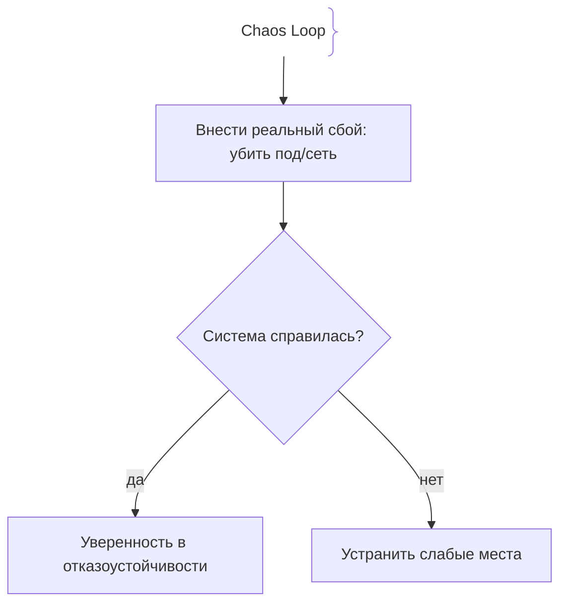
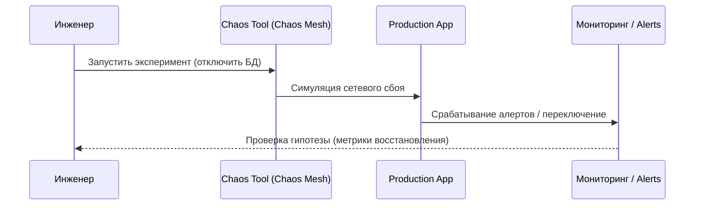

# Chaos Engineering (Инженерия хаоса)

## Определение

Chaos Engineering — дисциплина экспериментирования над системой в продакшене с целью выявления слабых мест путем намеренного внесения сбоев.

## Зачем нужен Chaos Engineering

Сложные распределенные системы падают непредсказуемо.
- **Проактивное обнаружение:** Найти баги и узкие места до того, как случится реальный инцидент.
- **Уверенность в resilience:** Проверка работы circuit breakers, retries и failover в реальных условиях.

## Как работает Chaos Engineering





## Примеры кода

> Ключевые сценарии: простой хаос-скрипт на Go для имитации задержки сети.

### Имитация задержки в коде для тестов (Go)

```go
package main

import (
	"math/rand"
	"time"
)

func simulateChaos(enabled bool) {
	if enabled && rand.Float32() < 0.1 {
		time.Sleep(2 * time.Second) // Внесение случайной задержки в 10% запросов
	}
}
```

## Пример использования: интеграция

Точка отказоустойчивости в коде: инжектируемая ошибка на этапе эксперимента:

```go
// chaosEnabled включается только под конфигурацией эксперимента,
// в проде по умолчанию выключено.
func maybeInjectFailure(p float64) error {
	if chaosEnabled && rand.Float64() < p {
		return errors.New("injected downstream failure")
	}
	return nil
}
```

Параллельно в кластере Chaos Mesh убивает поды/рвёт сеть согласно эксперименту, а метрики показывают, справилась ли система.

## Паттерны использования

- **Гипотеза о steady state** — сначала определи, как выглядит «нормально», потом ломай.
- **Blast radius ограничен** — эксперимент на минимальной доле трафика/под, под наблюдением алертов.
- **Постоянный хаос в проде** — младшие сервисы тестируются постоянно, критичные — точечно.
- **Каждый хаос привязан к RUNBOOK** — знаем заранее, что запускать и как остановить.

## Антипаттерны и ловушки

- **Хаос без метрик/алертов** — не видно, где система перестала отвечать.
- **Ломать всё сразу** — отсутствие blast radius превращает эксперимент в инцидент.
- **Инжекция в коде без выключателя** — вероятность «вне эксперимента» уходит в прод случайно.
- **Хаос как самоцель** — тест без гипотезы и action-item после провала ничего не улучшает.

## Когда использовать / когда НЕ использовать

- **Использовать:** распределённые системы с зависимостями, где важен resilience; перед крупными релизами и в steady-load днях.
- **НЕ использовать:** на стадии прототипа без SLI/SLO — сначала понять, что «работает», потом разрушать; для полностью внешнеуправляемых сервисов без инъекций.

## Связанные темы

- **disaster-recovery** — сценарии катастроф, проверяемые хаосом.
- **production-incidents** — реальные сбои, которые хаос имитирует контролируемо.
- **postmortems** — разбор провалов эксперимента по тем же правилам, что и инцидента.

## Вопросы

### Q1
**Что такое Chaos Engineering?**
- [ ] Написание плохого кода
- [x] Проведение контролируемых экспериментов с внесением сбоев в продакшн для проверки отказоустойчивости
- [ ] Отключение мониторинга
- [ ] Стресс-тест только базы данных

Пояснение: Это научный подход к поиску слабых мест через контролируемые поломки.

### Q2
**Где рекомендуется проводить эксперименты по инженерии хаоса?**
- [ ] Только на локальном ноутбуке
- [x] В стейджинге и продакшене (с соблюдением мер безопасности)
- [ ] Никогда
- [ ] Только в закрытых блокнотах

Пояснение: Реальные условия продакшена дают самые достоверные результаты.

### Q3
**Что является первым шагом эксперимента в Chaos Engineering?**
- [ ] Убить все сервера
- [x] Сформулировать гипотезу о нормальном поведении системы при сбое
- [ ] Удалить репозиторий
- [ ] Написать новый микросервис

Пояснение: Без гипотезы эксперимент превращается в простую порчу системы.

### Q4
**Что такое Blast Radius в инженерии хаоса?**
- [ ] Радиус взрыва ядерного реактора
- [x] Объем системы и пользователей, затронутых экспериментом
- [ ] Размер файла логов
- [ ] Скорость сети

Пояснение: Контроль Blast Radius позволяет минимизировать ущерб от эксперимента.

### Q5
**Какой инструмент часто используется для Chaos Engineering в Kubernetes?**
- [ ] Docker Hub
- [x] Chaos Mesh или LitmusChaos
- [ ] Webpack
- [ ] Git

Пояснение: Специализированные инструменты автоматизируют инжекцию сбоев в поды и сети K8s.

## Источники

- Principles of Chaos Engineering: https://principlesofchaos.org/
- Chaos Engineering by Casey Rosenthal and Nora Jones