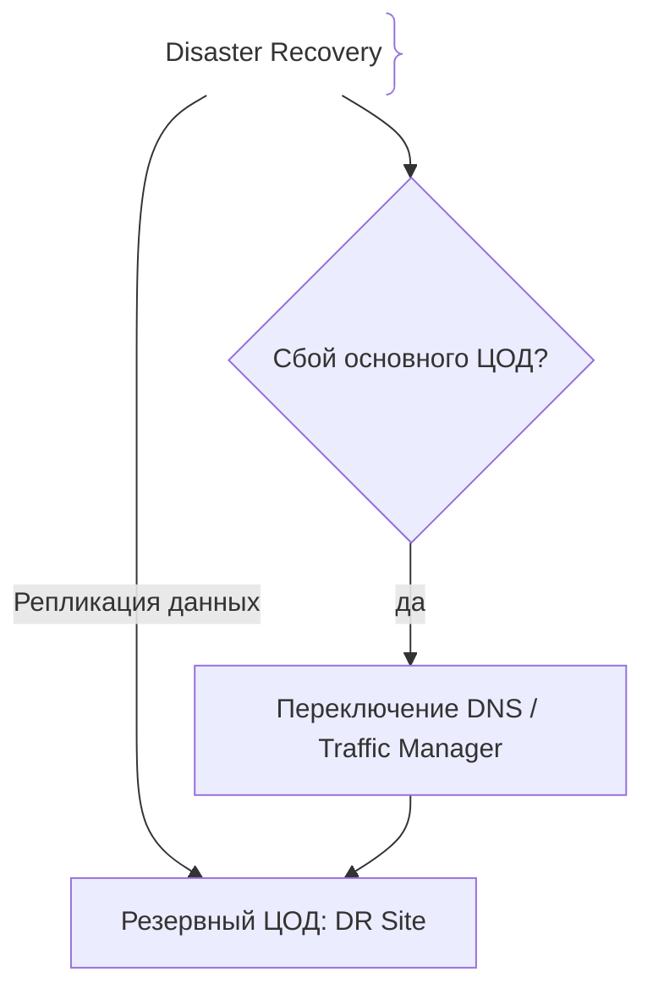
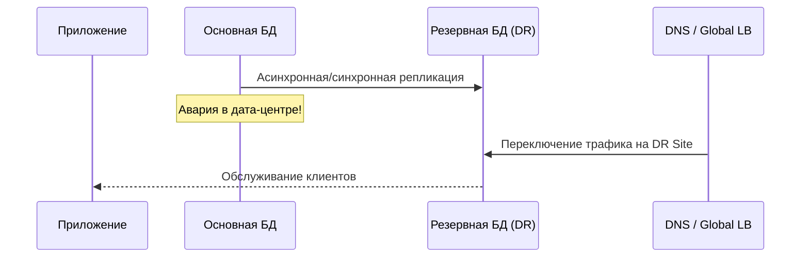

# Аварийное восстановление (Disaster Recovery)

## Определение

Disaster Recovery (DR) — комплекс стратегий, процедур и инструментов для восстановления IT-инфраструктуры и данных после катастрофических сбоев.

## Зачем нужен Disaster Recovery

Сбои оборудования, дата-центров или кибератаки могут полностью остановить бизнес.
- **RPO (Recovery Point Objective):** Допустимый объем потери данных по времени.
- **RTO (Recovery Time Objective):** Допустимое время простоя до восстановления сервиса.

## Как работает Disaster Recovery архитектура





## Примеры кода

> Ключевые сценарии: конфигурация репликации и проверки состояния для DR.

### Проверка здоровья и статуса репликации (Go)

```go
package main

import "fmt"

func checkDRStatus(lagSeconds int) bool {
	maxAllowedLag := 30
	if lagSeconds > maxAllowedLag {
		fmt.Println("Warning: DR replication lag is too high!")
		return false
	}
	return true
}
```

## Пример использования: интеграция

Автоматизированное переключение трафика на DR-сайт по результату health-проверок:

```go
func failoverIfDown(primary, dr, region string) string {
	if !healthOK(primary) {
		updateTrafficManager(dr, region) // DNS/LB → DR-регион
		log.Printf("failover to DR: %s", dr)
		return dr
	}
	return primary
}
```

Последовательность шагов описана в runbook'е: переключаем LB, проверяем готовность DR, синхронизируем данные до достижения RPO.

## Паттерны использования

- **RPO/RTO определены заранее** — сколько данных теряем и сколько времени терпим.
- **Резервный сайт с репликацией** — синхронная/асинхронная репликация зависит от требований RPO.
- **Регулярные DR-учения** — failover-прогон без реальной аварии: «выстрел из оружия должен был быть».
- **Runbook с людьми и ролями** — кто командует, решает, переключает — зафиксировано.

## Антипаттерны и ловушки

- **DR на бумаге без учений** — прогон в инцидент как правило проваливается из-за мелочей.
- **RPO=0 без технологий** — обещать нулевую потерю, но иметь асинхронную репликацию нельзя.
- **Секреты/конфиг живут только в основном регионе** — восстановление невозможно без них.
- **DR без мониторинга резерва** — восстановленный сервис умирает сразу после переключения.

## Когда использовать / когда НЕ использовать

- **Использовать:** сервисы с жёсткими требованиями к доступности; финансы, торговля, критичные B2B.
- **НЕ использовать:** не-критичным внутренним utilitям DR избыточен; тогда достаточно бэкапов и деплой-восстановления.

## Связанные темы

- **backups** — данные для восстановления в DR.
- **failover** — переключение на резерв как инструмент DR.
- **multi-region-deployment** — географическое разделение, на котором строится DR.

## Вопросы

### Q1
**Что такое RPO (Recovery Point Objective)?**
- [x] Максимально допустимый объем потерянных данных по времени с момента последней аварии
- [ ] Время восстановления сервиса
- [ ] Скорость интернета
- [ ] Количество серверов

Пояснение: RPO определяет, сколько данных потерять критично для бизнеса (например, не более 1 часа).

### Q2
**Что такое RTO (Recovery Time Objective)?**
- [ ] Объем потерянных данных
- [x] Максимально допустимое время простоя системы до полного восстановления
- [ ] Время компиляции кода
- [ ] Задержка сети

Пояснение: RTO задает рамки времени, за которые система должна подняться после сбоя.

### Q3
**В чем разница между Backup и Disaster Recovery?**
- [ ] Разницы нет
- [x] Backup — это создание копий данных, а DR — полноценный план восстановления всей инфраструктуры
- [ ] Backup только для облака
- [ ] DR не требует бэкапов

Пояснение: Бэкап — часть стратегии DR, но DR включает переключение трафика, сетей и инфраструктуры.

### Q4
**Какая репликация обеспечивает меньший RPO?**
- [ ] Асинхронная с отставанием в сутки
- [x] Синхронная репликация в реальном времени
- [ ] Ручной экспорт раз в неделю
- [ ] Отсутствие репликации

Пояснение: Синхронная репликация гарантирует нулевую потерю данных при сбое первичного узла (RPO = 0).

### Q5
**Почему важно регулярно тестировать план DR?**
- [ ] Чтобы потратить бюджет
- [x] Чтобы убедиться, что процедуры восстановления работают и укладываются в RTO/RPO
- [ ] Это требование компилятора
- [ ] Для ускорения тестов

Пояснение: Непроверенный план DR часто не работает в реальной аварийной ситуации.

## Источники

- AWS Disaster Recovery Guide: https://aws.amazon.com/
- Google SRE Book