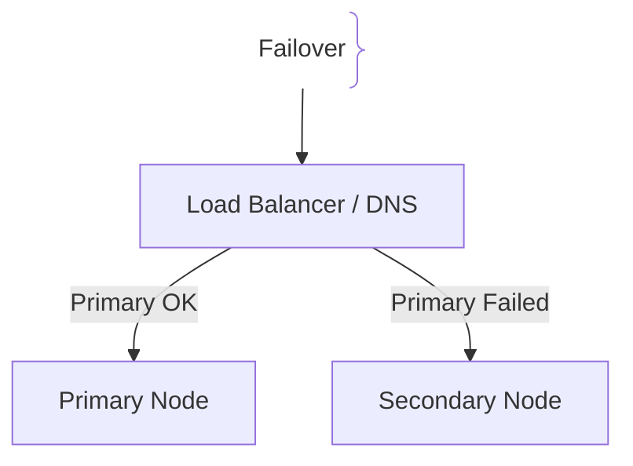
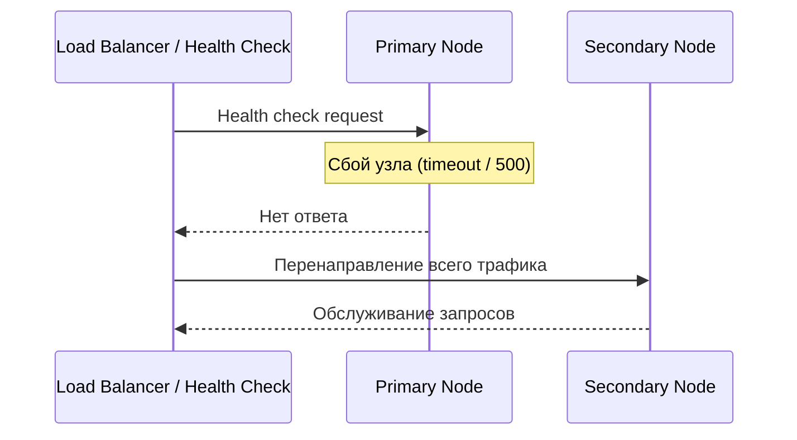

# Failover (Переключение на резерв)

## Определение

Failover — автоматический или ручной процесс переключения нагрузки на резервный узел или систему при отказе основного компонента.

## Зачем нужен Failover

Отказ оборудования или ПО не должен приводить к долгому простою.
- **High Availability (HA):** Обеспечение непрерывной работы сервиса (99.99%).
- **Автоматизация:** Быстрое реагирование без участия человека.

## Как работает Failover архитектура





## Примеры кода

> Ключевые сценарии: логика проверки здоровья и переключения в коде прокси/клиента.

### Проверка здоровья и переключение (Go)

```go
package main

import "net/http"

func isNodeHealthy(url string) bool {
	resp, err := http.Get(url + "/health")
	if err != nil || resp.StatusCode != http.StatusOK {
		return false
	}
	return true
}
```

## Пример использования: интеграция

Решение о переключении принимается health-проверками, а не человеком:

```go
var active string = "primary-a"

func checkAndFailover() {
	if !healthOK(active) {
		log.Printf("failover: %s -> %s", active, standby)
		active = standby               // LB переключает трафик на резерв
		go promote(standby)            // поднимаем резервную БД в primary
	}
}
```

После восстановления основного узла инициируется reverse-failover — трафик возвращается, а роль БД сдаётся обратно.

## Паттерны использования

- **Health-проверки как триггер** — переключение происходит без ожидания человека.
- **Симметричная конфигурация резерва** — standby идентичен primary, иначе переключение ломает систему.
- **Reverse-failover с проверкой** — возврат на primary только после подтверждения его готовности.
- **Split-brain защита** — ресурс, управляемый одним узлом, не должен подниматься двумя (quorum/леasing).

## Антипаттерны и ловушки

- **Manual failover в проде** — реагирует человек со спящим пейджером, а не автомат.
- **Асинхронная репликация + быстрое переключение** — часть данных теряется без RPO-договора.
- **Split-brain** — оба узла считают себя primary и делят записы — данные расходятся.
- **Ложное срабатывание health** — сетевой сбой пробы переключает трафик без надобности.

## Когда использовать / когда НЕ использовать

- **Использовать:** критичные сервисы с требованием HA 99.9%+; БД и балансировка с автоматическим переключением.
- **НЕ использовать:** когда потери данных при переключении неприемлемы без серьёзного RPO-дизайна; для временных сервисов без требования к пути отказоустойчивости.

## Связанные темы

- **disaster-recovery** — failover как часть DR-стратегии.
- **backups** — финальная защита поверх переключения.
- **multi-region-deployment** — масштабирование failover между регионами.

## Вопросы

### Q1
**Что такое Failover?**
- [ ] Создание бэкапа
- [x] Автоматическое или ручное переключение на резервный узел при сбое основного
- [ ] Удаление старых логов
- [ ] Балансировка нагрузки

Пояснение: Failover обеспечивает бесперебойность за счет переключения на живой резерв.

### Q2
**В чем разница между Failover и Failback?**
- [ ] Разницы нет
- [x] Failover — переход на резерв, Failback — возврат на основной узел после его починки
- [ ] Failback — это удаление данных
- [ ] Failover происходит только вручную

Пояснение: Обратный процесс возврата к исходной конфигурации называется Failback.

### Q3
**Что такое Split-Brain в контексте Failover?**
- [ ] Ошибка компиляции
- [x] Ситуация, когда два узла считают себя главными (Primary), что ведет к повреждению данных
- [ ] Разделение памяти
- [ ] Перегрев CPU

Пояснение: Опасное состояние распределенной системы, требующее механизмов Leader Election и Fencing.

### Q4
**Какой компонент обычно инициирует автоматический Failover?**
- [ ] Браузер пользователя
- [x] Health Checks и системы мониторинга/оркестрации
- [ ] CSS-стили
- [ ] Компилятор

Пояснение: Мониторинг обнаруживает отказ и запускает процедуру переключения.

### Q5
**Что такое Graceful Failover?**
- [ ] Мгновенное отключение питания
- [x] Плановое переключение без потери активных транзакций и с минимальным прерыванием
- [ ] Ошибка сети
- [ ] Отмена деплоя

Пояснение: Плавное переключение позволяет завершить текущие запросы перед уходом на резерв.

## Источники

- High Availability Architectures: https://martinfowler.com/
- Distributed Systems Engineering