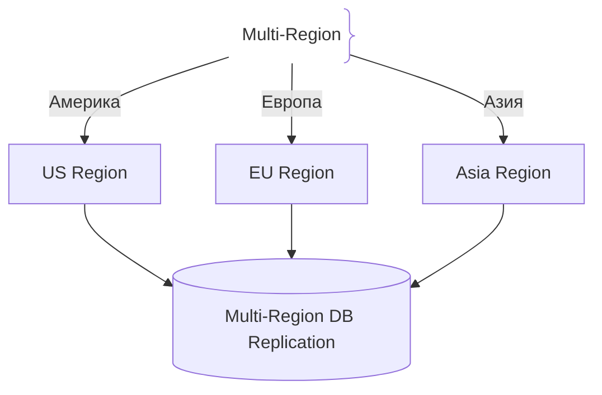
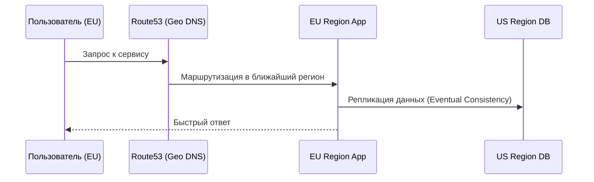

# Развёртывание в нескольких регионах (Multi-Region Deployment)

## Определение

Multi-Region Deployment — архитектурный подход, при котором приложение разворачивается в нескольких географически распределенных облачных регионах.

## Зачем нужен Multi-Region

Локальные сбои дата-центров или провайдеров не должны останавливать глобальный бизнес.
- **Низкая задержка (Latency):** Пользователи обслуживаются ближайшим регионом.
- **Географическая отказоустойчивость:** Падение целого региона AWS не приводит к падению сервиса.

## Как работает Multi-Region архитектура





## Примеры кода

> Ключевые сценарии: гео-маршрутизация и подключение к ближайшей базе данных.

### Конфигурация клиента БД с выбором региона (TypeScript)

```typescript
const region = process.env.AWS_REGION || 'us-east-1'
const dbConfig = {
  host: `db.${region}.internal.net`,
  port: 5432,
}
```

## Пример использования: интеграция

Клиент выбирает ближайший по задержке регион:

```ts
const REGIONS = [
  { id: 'eu-central-1', baseUrl: 'https://eu.api.example.com' },
  { id: 'us-east-1', baseUrl: 'https://us.api.example.com' },
]

async function nearestRegion() {
  const latencies = await Promise.all(
    REGIONS.map(async (r) => ({
      region: r,
      rtt: await measureRtt(`${r.baseUrl}/ping`, 3),
    })),
  )
  return latencies.sort((a, b) => a.rtt - b.rtt)[0].region
}
```

На проде маршрутизацией занимаются гео-DNS и Global Accelerator — клиент просто ходит на ближайший endpoint.

## Паттерны использования

- **Ближайший регион для пользователя** — гео-DNS/Latency-routing базируется на задержке.
- **Асинхронная репликация между регионами** — данные в каждом регионе копируются в другие.
- **Активная-активная или активная-пассивная** — трафик делится или один регион в режиме DR.
- **Мониторинг per-region** — метрики и алерты разделены по регионам, иначе сбой скрыт средним.

## Антипаттерны и ловушки

- **Multi-region без репликации БД** — приложение в двух регионах, а данные в одном.
- **Забыть про синхронные зависимости** — запись в БД «из другого региона» рушит латентность.
- **Разные версии/конфиги регионов** — трафик переключается, но сервис ведёт себя по-другому.
- **Сбои регионов продвигать «вручную»** — slow DNS-TTL и ручной failover продлевают простой.

## Когда использовать / когда НЕ использовать

- **Использовать:** глобальные сервисы с клиентами на нескольких континентах; требования к нулевому downtime регионов.
- **НЕ использовать:** локальные продукты с клиентами в одном часовом поясе — стоимость двойного окружения и репликации не окупится; тогда достаточно одного региона + DR.

## Связанные темы

- **disaster-recovery** — многорегиональная схема как основа DR.
- **failover** — переключение трафика между регионами.
- **backups** — защита данных, распределённых по регионам.

## Вопросы

### Q1
**Главное преимущество Multi-Region Deployment?**
- [ ] Дешевая инфраструктура
- [x] Высокая доступность при падении целого облачного региона и низкая задержка для пользователей
- [ ] Простой код
- [ ] Отсутствие баз данных

Пояснение: Защищает от масштабных аварий провайдера и ускоряет ответ для удаленных пользователей.

### Q2
**Какая главная сложность в Multi-Region системах?**
- [ ] Написание HTML
- [x] Синхронизация и консистентность данных между регионами с учетом сетевой задержки
- [ ] Покупка доменов
- [ ] Настройка CSS

Пояснение: CAP-теорема и скорость света накладывают ограничения на репликацию данных.

### Q3
**Что такое Geo-DNS?**
- [ ] Карта мира
- [x] Маршрутизация пользователей на сервер в зависимости от их географического положения
- [ ] Определение IP
- [ ] Защита от DDoS

Пояснение: Направляет клиента в ближайший дата-центр.

### Q4
**Что происходит при падении одного из регионов в Multi-Region?**
- [ ] Падает вся система
- [x] Global DNS перенаправляет трафик на оставшиеся живые регионы
- [ ] Удаляются бэкапы
- [ ] Перезагружаются ПК пользователей

Пояснение: Автоматический failover на уровне глобальной маршрутизации.

### Q5
**Какая модель консистентности чаще всего используется между регионами?**
- [ ] Строгая (Linearizable) без задержек
- [x] Итоговая (Eventual Consistency) из-за физических ограничений скорости передачи данных
- [ ] Отсутствие согласованности
- [ ] Только локальная

Пояснение: Синхронизировать все регионы мгновенно физически невозможно из-за пингов.

## Источники

- AWS Multi-Region Architecture: https://aws.amazon.com/
- Designing Data-Intensive Applications by Martin Kleppmann