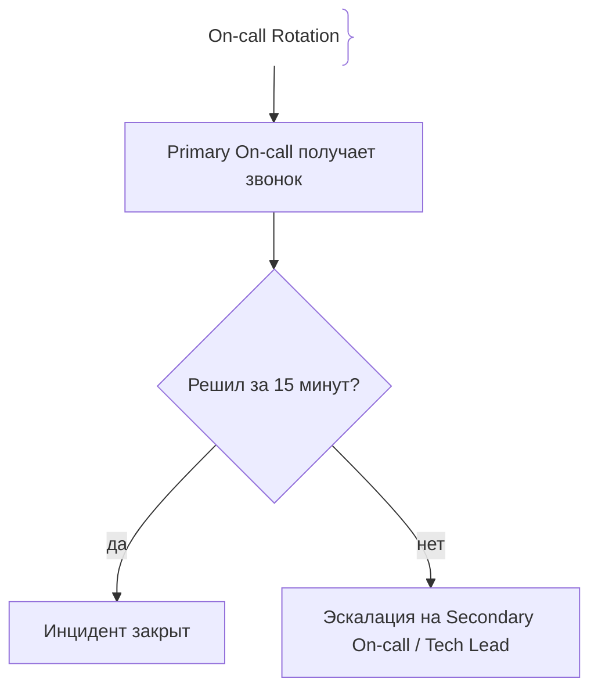
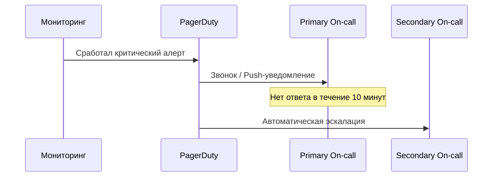

# Дежурства (On-call)

On-call — система дежурств инженеров, обеспечивающая круглосуточную реакцию на инциденты и алерты продакшена.

## Зачем нужны дежурства

Продакшн работает 24/7, и проблемы могут возникнуть в любой момент.
- **Ответственность:** Всегда есть человек, готовый отреагировать на алерт.
- **Справедливое распределение:** Ротация дежурных предотвращает выгорание (burnout).

## Как работает On-call ротация





## Примеры кода

> Ключевые сценарии: настройка графика ротации в PagerDuty (Terraform).

### Terraform PagerDuty Escalation Policy

```hcl
resource "pagerduty_escalation_policy" "sre_policy" {
  name = "SRE Escalation Policy"
  rule {
    escalation_delay_in_minutes = 15
    target {
      type = "user_reference"
      id   = "U_ENGINEER_1"
    }
  }
}
```

## Вопросы

### Q1
**Главная цель системы On-call дежурств?**
- [ ] Наказание разработчиков за баги
- [x] Обеспечение непрерывного мониторинга и оперативного реагирования на инциденты 24/7
- [ ] Увеличение продаж
- [ ] Ускорение компиляции

Пояснение: Дежурные гарантируют реакцию на аварии в любое время суток.

### Q2
**Что такое эскалация (Escalation) в On-call?**
- [ ] Увольнение сотрудника
- [x] Передача алерта на следующий уровень (Secondary On-call или Manager) при отсутствии ответа от первого дежурного
- [ ] Увеличение нагрузки на CPU
- [ ] Удаление логов

Пояснение: Эскалация защищает от ситуаций, когда основной дежурный недоступен.

### Q3
**Почему важно ограничивать количество ложных алертов (Noise Reduction)?**
- [ ] Чтобы тратить меньше бумаги
- [x] Чтобы предотвратить утомление от алертов (Alert Fatigue) и пропуск реальных аварий
- [ ] Для ускорения интернета
- [ ] Требование дизайна

Пояснение: Когда алертам перестают верить из-за шума, реальные аварии пропускаются.

### Q4
**Что такое Follow-the-Sun модель дежурств?**
- [ ] Дежурство только днем
- [x] Распределение дежурств между инженерами в разных часовых поясах, чтобы никто не дежурил ночью
- [ ] Следование за солнцем на пляже
- [ ] Отказ от ночных смен без замены

Пояснение: Эффективный метод для глобальных распределенных команд.

### Q5
**Что такое Post-Incident Review для дежурного?**
- [ ] Жалоба на систему
- [x] Анализ того, насколько понятным и полезным был полученный алерт и как его улучшить
- [ ] Увольнение
- [ ] Удаление алертов

Пояснение: Дежурные постоянно улучшают качество алертов на основе реального опыта.

## Источники

- PagerDuty On-Call Best Practices: https://www.pagerduty.com/
- Google SRE Book: Managing Incidents