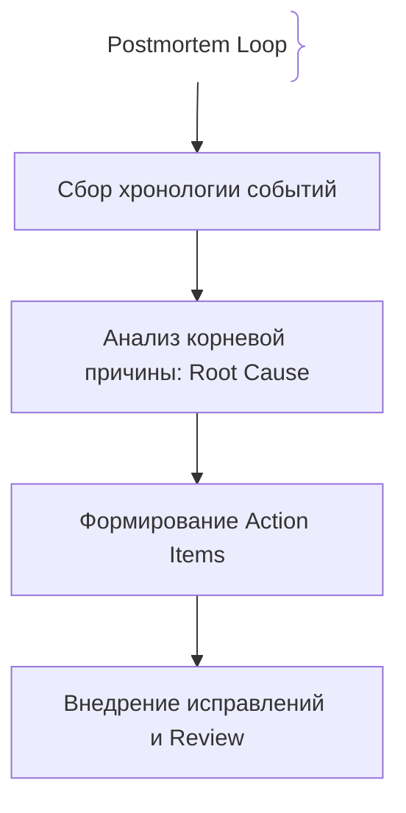
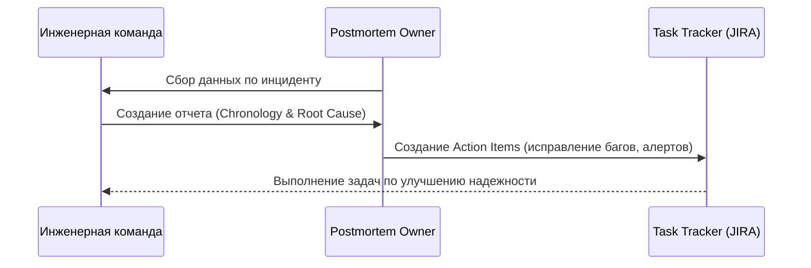

# Postmortems (Разборы инцидентов)

Postmortem — детальный отчет и анализ прошедшего инцидента с целью выявления корневых причин и предотвращения их повторения в будущем.

## Зачем нужны Postmortems

Ошибки неизбежны, но повторять их дважды — непрофессионально.
- **Blameless Culture (Культура без поиска виноватых):** Фокус на системных сбоях, а не на человеческом факторе.
- **Action Items:** Конкретные задачи по улучшению архитектуры и мониторинга.

## Как работает процесс Postmortem





## Примеры кода

> Ключевые сценарии: шаблон Postmortem-документа (Markdown).

### Шаблон Postmortem (Markdown)

```markdown
# Postmortem: Инцидент с падением Checkout API (INC-1024)
- **Дата:** 2026-06-06
- **Автор:** SRE Team
- **Статус:** Completed
- **Impact:** 15 минут простоя, потеря 2% транзакций.
- **Root Cause:** Исчерпание пула соединений БД из-за медленного запроса.
- **Action Items:**
  - [ ] Оптимизировать SQL-запрос (JIRA-501)
  - [ ] Добавить алерт на исчерпание connection pool (JIRA-502)
```

## Вопросы

### Q1
**Что такое Blameless Postmortem?**
- [ ] Отчет без указания автора
- [x] Разбор инцидента без поиска виноватых, с фокусом на системные проблемы и процессы
- [ ] Отчет, скрывающий ошибки
- [ ] Наказание виновных

Пояснение: Культура без поиска виноватых поощряет открытый анализ и предотвращает сокрытие проблем.

### Q2
**Что такое Action Items в Postmortem?**
- [ ] Список участников
- [x] Конкретные задачи по устранению уязвимостей и предотвращению повторения инцидента
- [ ] Логи ошибок
- [ ] Список серверов

Пояснение: Без Action Items postmortem превращается в бесполезную бюрократическую отписку.

### Q3
**Какая главная цель поиска Root Cause (корневой причины)?**
- [ ] Найти кого уволить
- [x] Понять фундаментальную причину сбоя на уровне архитектуры или процессов
- [ ] Удалить базу данных
- [ ] Изменить пароль

Пояснение: Поиск истинной причины позволяет внедрить системную защиту.

### Q4
**Что входит в хронологию (Timeline) postmortem?**
- [ ] Только время падения
- [x] Точная последовательность событий от момента обнаружения до полного восстановления
- [ ] Список всех сотрудников компании
- [ ] Код приложения

Пояснение: Хронология помогает восстановить точную картину развития аварии.

### Q5
**Кто должен участвовать в разборе postmortem?**
- [ ] Только генеральный директор
- [x] Инженеры, дежурные, разработчики и все причастные к инциденту и системе команды
- [ ] Только стажеры
- [ ] Никто

Пояснение: Коллективный опыт всех участников помогает увидеть проблему шире.

## Источники

- Google SRE Book: Postmortem Culture
- PagerDuty Post-Incident Review Guide