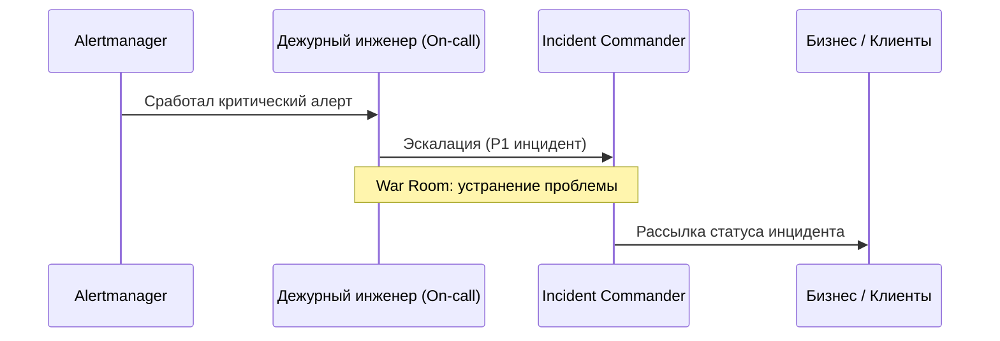

# Инциденты в продакшене (Production Incidents)

Production Incident — незапланированное прерывание работы сервиса или ухудшение его качества для пользователей.

## Зачем нужен процесс управления инцидентами

Хаос во время аварии приводит к долгому простою и потере доверия клиентов.
- **Быстрая локализация (MTTR):** Сокращение времени восстановления.
- **Прозрачная коммуникация:** Информирование бизнеса и пользователей.

## Как работает процесс инцидентов




## Примеры кода

> Ключевые сценарии: структура уведомления об инциденте.

### JSON-структура сообщения в шину алертов

```json
{
  "incident_id": "INC-8492",
  "severity": "SEV-1",
  "service": "checkout-api",
  "status": "investigating",
  "owner": "sre-oncall@company.com"
}
```

## Вопросы

### Q1
**Что такое MTTR (Mean Time to Resolution / Recovery)?**
- [ ] Время написания кода
- [x] Среднее время, необходимое для восстановления системы после сбоя
- [ ] Время простоя серверов
- [ ] Скорость компиляции

Пояснение: Ключевая метрика эффективности команды инцидент-менеджмента.

### Q2
**Что такое SEV-1 (Severity 1) инцидент?**
- [ ] Опечатка в тексте сайта
- [x] Критическая авария, затрагивающая большинство пользователей и останавливающий бизнес
- [ ] Медленный запрос у одного клиента
- [ ] Плановые работы

Пояснение: Наивысший уровень критичности инцидента.

### Q3
**Какая главная задача Incident Commander во время аварии?**
- [ ] Самому писать весь код для фикса
- [x] Управлять процессом, координацией команды и коммуникацией, освобождая инженеров для поиска решения
- [ ] Удалять логи
- [ ] Писать тесты

Пояснение: Командир инцидента координирует действия, а не кодит сам.

### Q4
**Что такое War Room (или Incident Bridge)?**
- [ ] Комната отдыха
- [x] Выделенный чат/аудиоканал для оперативной работы над устранением аварии
- [ ] Серверная комната
- [ ] База данных

Пояснение: Единое пространство связи для всех участников ликвидации инцидента.

### Q5
**Что делается сразу после стабилизации системы (Mitigation)?**
- [ ] Удаление репозитория
- [x] Фиксация таймлайна, проведение postmortem и анализ причин
- [ ] Отпуск команды
- [ ] Смена домена

Пояснение: После устранения симптомов необходимо глубоко проанализировать причины.

## Источники

- Google SRE Workbook: Incident Management
- PagerDuty Incident Response Docs