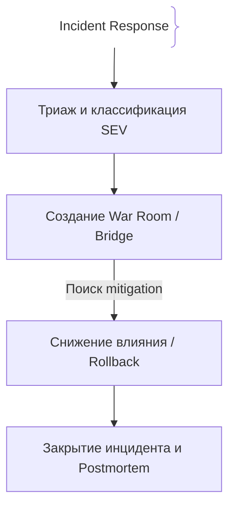
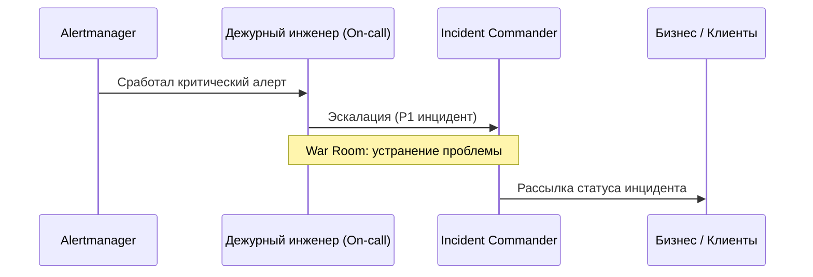

# Инциденты в продакшене (Production Incidents)

## Определение

Production Incident — незапланированное прерывание работы сервиса или ухудшение его качества для пользователей.

## Зачем нужен процесс управления инцидентами

Хаос во время аварии приводит к долгому простою и потере доверия клиентов.
- **Быстрая локализация (MTTR):** Сокращение времени восстановления.
- **Прозрачная коммуникация:** Информирование бизнеса и пользователей.

## Как работает процесс инцидентов





## Примеры кода

> Ключевые сценарии: структура уведомления об инциденте.

### JSON-структура сообщения в шину алертов

```json
{
  "incident_id": "INC-8492",
  "severity": "SEV-1",
  "service": "checkout-api",
  "status": "investigating",
  "owner": "sre-oncall@company.com"
}
```

## Пример использования: интеграция

Хэндофф инцидента дежурным в тикет — хронология и статус для вовлечённых:

```json
{
  "incident": "INC-1042",
  "sev": "SEV1",
  "status": "mitigating",
  "services": ["api", "payments"],
  "detected_at": "2026-09-21T05:12:00Z",
  "commander": "alice@example.com",
  "timeline": [
    { "t": "05:12", "what": "alert: error_rate 12%" },
    { "t": "05:17", "what": "rollback to 1.3.9" },
    { "t": "05:31", "what": "error_rate < 0.5%, monitoring" }
  ]
}
```

Роли вроде Incident Commander и те, кто пишет время и людей, фиксируются в тикете — война с инцидентом структурирована, а не «хаос».

## Паттерны использования

- **Триаж и SEV-классификация** — скорость реакции зависит от серьёзности (SEV1 — немедленно).
- **Incident Commander + roles** — один командует, остальные выполняют, никто не пишет код вне плана.
- **War room и чёткая коммуникация** — статус для бизнеса отдельно от технической работы.
- **MTTR-документирование** — время обнаружения, реакций, восстановления — фиксируются по ходу.

## Антипаттерны и ловушки

- **Один человек делает всё** — triage, fix, communication в одних руках — риск потери контекста.
- **Паника вместо ролей** — без commander решения принимают одновременно все.
- **Весь инцидент «в голове»** — история не пишется, postmortem ссылается на память.
- **Героический фикс вместо mitigation** — сначала вернуть сервис (rollback/blackout), потом расследовать.

## Когда использовать / когда НЕ использовать

- **Использовать:** любая production-система с настроенным on-call; обязательно при SLA и публичной ответственности.
- **НЕ использовать:** процесс избыточен для ещё не критичных стадий — но базовая форма (пейджер + тикет + постмортем) нужна заранее, до первого серьёзного инцидента.

## Связанные темы

- **on-call** — кто реагирует на инцидент.
- **postmortems** — разбор после восстановления.
- **disaster-recovery** — когда инцидент перерастает в катастрофу.

## Вопросы

### Q1
**Что такое MTTR (Mean Time to Resolution / Recovery)?**
- [ ] Время написания кода
- [x] Среднее время, необходимое для восстановления системы после сбоя
- [ ] Время простоя серверов
- [ ] Скорость компиляции

Пояснение: Ключевая метрика эффективности команды инцидент-менеджмента.

### Q2
**Что такое SEV-1 (Severity 1) инцидент?**
- [ ] Опечатка в тексте сайта
- [x] Критическая авария, затрагивающая большинство пользователей и останавливающий бизнес
- [ ] Медленный запрос у одного клиента
- [ ] Плановые работы

Пояснение: Наивысший уровень критичности инцидента.

### Q3
**Какая главная задача Incident Commander во время аварии?**
- [ ] Самому писать весь код для фикса
- [x] Управлять процессом, координацией команды и коммуникацией, освобождая инженеров для поиска решения
- [ ] Удалять логи
- [ ] Писать тесты

Пояснение: Командир инцидента координирует действия, а не кодит сам.

### Q4
**Что такое War Room (или Incident Bridge)?**
- [ ] Комната отдыха
- [x] Выделенный чат/аудиоканал для оперативной работы над устранением аварии
- [ ] Серверная комната
- [ ] База данных

Пояснение: Единое пространство связи для всех участников ликвидации инцидента.

### Q5
**Что делается сразу после стабилизации системы (Mitigation)?**
- [ ] Удаление репозитория
- [x] Фиксация таймлайна, проведение postmortem и анализ причин
- [ ] Отпуск команды
- [ ] Смена домена

Пояснение: После устранения симптомов необходимо глубоко проанализировать причины.

## Источники

- Google SRE Workbook: Incident Management
- PagerDuty Incident Response Docs