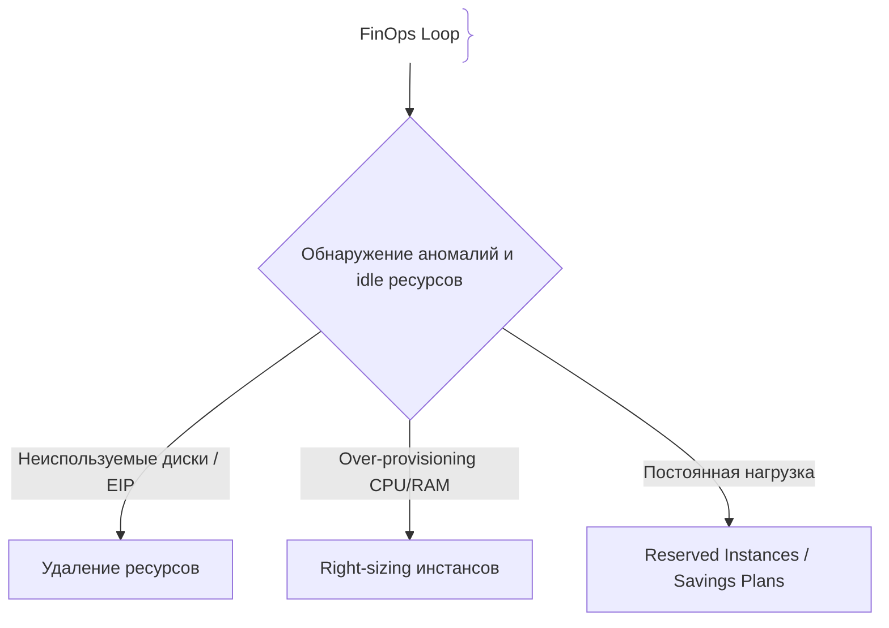
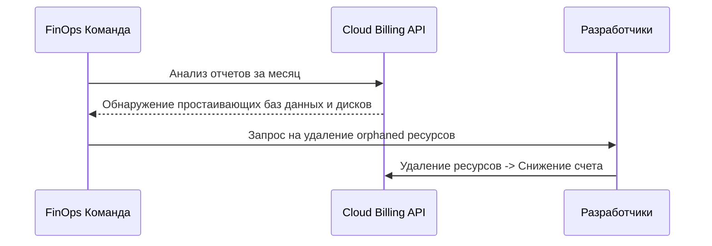

# Оптимизация расходов (Cost Optimization)

Cost Optimization (FinOps) — практика управления облачными затратами и оптимизации использования ресурсов для снижения расходов бизнеса без потери производительности.

## Зачем нужна оптимизация расходов

Облачные счета могут расти экспоненциально при отсутствии контроля.
- **FinOps:** Объединение финансов, технологий и бизнеса для контроля затрат.
- **Предотвращение утечек бюджета:** Своевременное удаление неиспользуемых ресурсов (Zombies).

## Как работает оптимизация затрат





## Примеры кода

> Ключевые сценарии: анализ и фильтрация неиспользуемых ресурсов (пример логики на TypeScript).

### Поиск ресурсов без тегов владельца (TypeScript)

```typescript
interface CloudResource {
  id: string
  name: string
  tags: Record<string, string>
  lastUsedDays: number
}

function findZombieResources(resources: CloudResource[]): CloudResource[] {
  return resources.filter(res => res.lastUsedDays > 30 && !res.tags['owner'])
}
```

## Вопросы

### Q1
**Что такое FinOps?**
- [ ] Финансовый аудит бухгалтерии
- [x] Культурная практика и методология управления облачными финансами и затратами
- [ ] Протокол шифрования
- [ ] Новый язык программирования

Пояснение: FinOps объединяет инженеров и финансистов для контроля облачных расходов.

### Q2
**Что такое Right-sizing в контексте облаков?**
- [ ] Покупка самых дорогих серверов
- [x] Подбор оптимального размера (CPU/RAM) инстансов под реальные нужды приложения
- [ ] Увеличение дисков в 2 раза
- [ ] Удаление кода

Пояснение: Right-sizing устраняет избыточное выделение ресурсов (over-provisioning).

### Q3
**Что такое Reserved Instances (RI) или Savings Plans?**
- [ ] Запрет на использование облака
- [x] Обязательство по использованию ресурсов на 1-3 года в обмен на значительную скидку
- [ ] Временные бесплатные сервера
- [ ] Бэкапы баз данных

Пояснение: Позволяет существенно снизить стоимость стабильно работающих нагрузок.

### Q4
**Какие ресурсы чаще всего остаются забытыми («зомби-ресурсы»)?**
- [ ] Активные базы данных
- [x] Неотмонтированные диски (EBS), старые снапшоты и неиспользуемые IP-адреса
- [ ] Основной код приложения
- [ ] Логи

Пояснение: Забытые диски и снапшоты продолжают расходовать бюджет компании.

### Q5
**Почему Serverless считается экономически выгодным при низкой нагрузке?**
- [ ] Он бесплатный навсегда
- [x] Вы платите только за реальное время выполнения запросов, а не за простаивающие сервера
- [ ] Он не требует интернета
- [ ] В нем нет багов

Пояснение: Модель pay-as-you-go избавляет от оплаты простоя в нерабочие часы.

## Источники

- AWS Well-Architected Framework: Cost Optimization Pillar
- FinOps Foundation: https://www.finops.org/