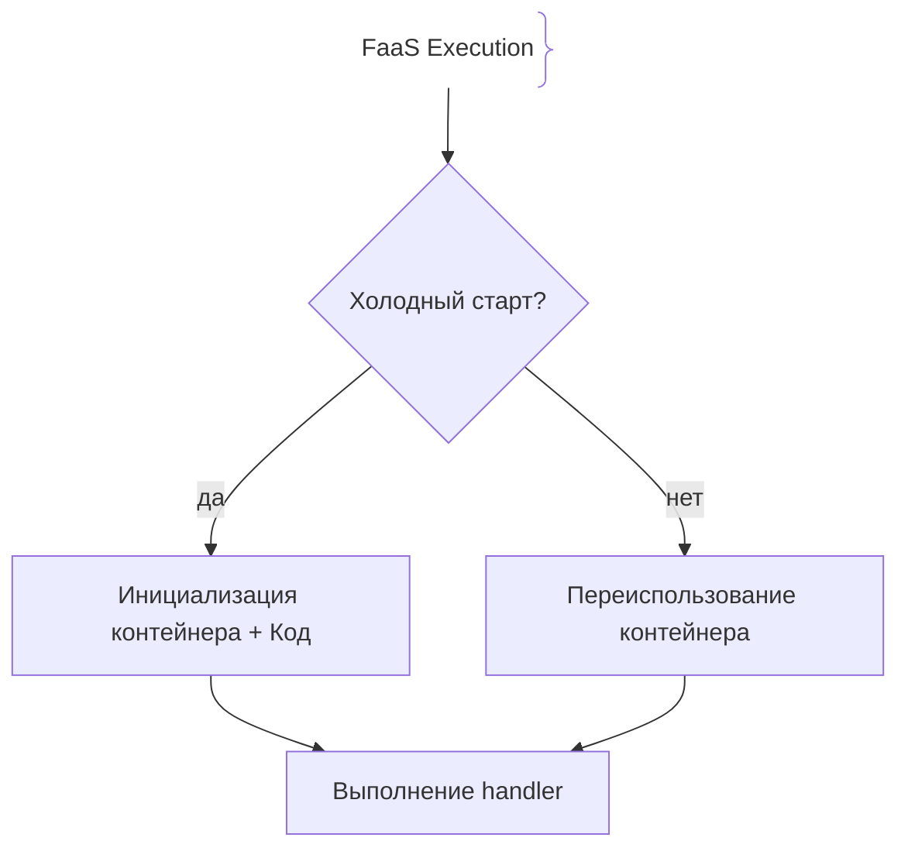
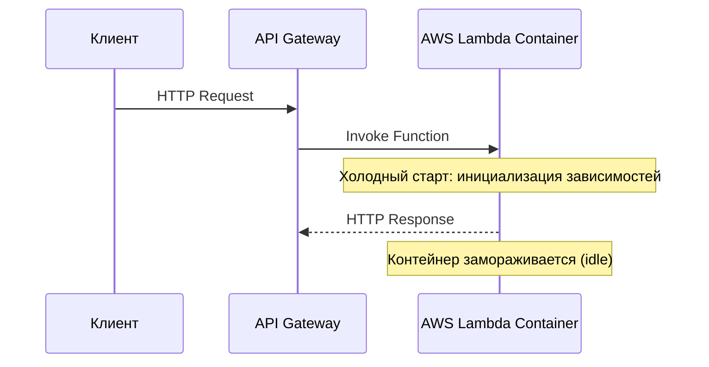

# Ограничения Serverless (Serverless Limitations)

Serverless (FaaS) избавляет от управления серверами, но накладывает жесткие технические ограничения на архитектуру и выполнение кода.

## Зачем знать ограничения Serverless

Непонимание особенностей FaaS приводит к сбоям, деградации производительности и перерасходу бюджета.
- **Statecharts & Stateless:** Функции полностью stateless, любые данные в памяти теряются между вызовами.
- **Timeouts:** Жесткий лимит на время выполнения запроса (например, 15 минут в AWS Lambda).

## Как работает Serverless архитектура





## Примеры кода

> Ключевые сценарии: обработка событий в AWS Lambda на TypeScript с учетом stateless природы.

### AWS Lambda Handler (TypeScript)

```typescript
import { APIGatewayProxyEvent, APIGatewayProxyResult } from 'aws-lambda'

// Кэширование подключений вне handler (переиспользуется при теплых стартах)
let isInitialized = false

export const handler = async (event: APIGatewayProxyEvent): Promise<APIGatewayProxyResult> => {
  if (!isInitialized) {
    // Инициализация пула БД или клиентов
    isInitialized = true
  }

  return {
    statusCode: 200,
    body: JSON.stringify({ message: 'Hello from Serverless!' }),
  }
}
```

## Вопросы

### Q1
**Что означает Stateless природа Serverless функций?**
- [ ] Функции не имеют доступа к интернету
- [x] Локальное состояние в памяти не сохраняется между вызовами функции
- [ ] Функции работают вечно
- [ ] Данные хранятся в оперативной памяти бесконечно

Пояснение: Контейнеры с функциями могут уничтожаться или замораживаться, поэтому хранить состояние в памяти нельзя.

### Q2
**Что такое Cold Start (холодный старт) в FaaS?**
- [ ] Запуск сервера по утрам
- [x] Задержка при первом вызове функции, когда провайдер выделяет контейнер и инициализирует среду выполнения
- [ ] Ошибка компиляции
- [ ] Сбой сети

Пояснение: Холодный старт добавляет latency к первому запросу после периода простоя.

### Q3
**Какой типичный максимальный таймаут выполнения для AWS Lambda?**
- [ ] 30 секунд
- [x] 15 минут
- [ ] 24 часа
- [ ] Без ограничений

Пояснение: AWS Lambda ограничивает выполнение одной функции максимум 15 минутами.

### Q4
**Где нужно инициализировать соединения с базой данных в Lambda?**
- [ ] Внутри хендлера при каждом вызове
- [x] Вне хендлера (глобально), чтобы переиспользовать при теплых стартах
- [ ] На клиентской стороне
- [ ] В браузере

Пояснение: Инициализация вне хендлера позволяет избежать повторного подключения к БД на теплых стартах.

### Q5
**Главная сложность при отладке и мониторинге Serverless?**
- [ ] Высокая стоимость клавиатур
- [x] Распределенный характер, отсутствие доступа к ОС и короткое время жизни контейнеров
- [ ] Медленный интернет
- [ ] Нельзя писать тесты

Пояснение: Сложно собирать логи и трассировать запросы без доступа к физической инфраструктуре.

## Источники

- AWS Lambda Docs: https://docs.aws.amazon.com/lambda/
- Serverless Architectures by Martin Fowler